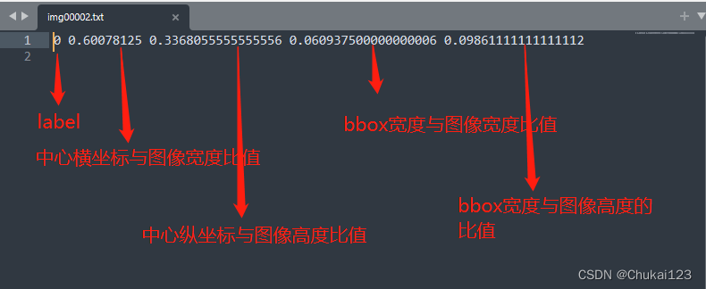

# pytorch-yolov7

https://blog.csdn.net/qq_45194640/article/details/125952860

https://github.com/qiaofengsheng/pytorch-yolov7

https://www.bilibili.com/video/BV1kU4y1i7Ts

使用yolov7训练自己的数据集

参考：https://github.com/WongKinYiu/yolov7

# 当前环境

YOLOR 🚀 225cc2a torch 1.12.1+cu116 CUDA:0 (NVIDIA GeForce RTX 3050 Ti Laptop GPU, 3910.8125MB)


# voc转yolo

```shell
python3 voc_to_yolo.py
```
> 可以直接使用LabelImg来获取Yolo格式的数据集


## 修改地址，数据转换（不是很重要）


# 使用官方的默认模型跑数据

## 模型下载

### 

https://ghproxy.com/https://github.com/WongKinYiu/yolov7/releases/download/v0.1/yolov7.pt


1. 添加需要识别的图片或者视频到`inference/images`文件夹里。
2. 运行以下脚本

```shell
python3 detect.py
```

下面可以指定自己训练的模型文件


3. 结果在下图


traced_model.pt 这个文件是在运行 `python3 detect.py` 自动生成的记录文件，不是模型文件。


# 自己准备数据，训练模型

## 安装labelImg

https://github.com/heartexlabs/labelImg

```shell
pip3 install labelImg
labelImg
```


将自己标记的数据，整理好放到下面对应文件夹


```text
0 0.571000 0.637931 0.470000 0.494929
```

第一个数字 0 表示对应的分类，这里是两种cat和dog，cat是1，dog是0

第2，3个值表示识别的物体的中心点和图片的比例。

第2，3个值表示识别的物体的高度与宽度和原图的比例。



> 归一化处理，0-1范围内。增强泛化能力，这样图像进行压缩处理，也不会影响模型训练。

## 直接训练即可

```shell
python3 train.py
```

## 自己训练得到的模型文件


## 最后效果

0.04是置信度


> 如果最后结果没有识别出来啥，建议调整阈值即可


一般来说需要足够多达标的数据才有比较好的结果

# 调参

## 针对特定的类别识别处理

https://blog.csdn.net/frcbob/article/details/123440979


## 设置识别的置信度阈值

默认0.25

> 如果自己打标的数据，训练出来的模型，怎么也无法检测出目标，那么可以尝试修改下面阈值，改到比较低的值试试。


# 视频处理

视频经过算法之后就没有了声音，所以想要有声音就需要特殊处理。yolo算法本身应该是无法处理音频的。

1. 预先提取下视频里面的音频保留。

```shell
ffmpeg -i '视频文件.mp4' -q:a 0 -map a output.mp3
```

> https://blog.csdn.net/Mr_robot_strange/article/details/121156451

2. 把yolo跑出来的数据和上面预先提取的音频合并下即可。

```shell
ffmpeg -i 'yolo的结果视频文件没有声音.mp4'  -i 'output.mp3'  -c:v copy -c:a aac -strict experimental -map 0:v:0 -map 1:a:0 yolo结果有声音的文件.mp4
```

> https://www.zhihu.com/question/300182407

# 应用场景

1. [判断带没带头盔](https://zhuanlan.zhihu.com/p/547878330)

# Refer
1. [写给小白的YOLO介绍](https://zhuanlan.zhihu.com/p/94986199)
1. [YoloV7:训练自己得数据集详细教程](https://blog.csdn.net/zhangdaoliang1/article/details/125719437)