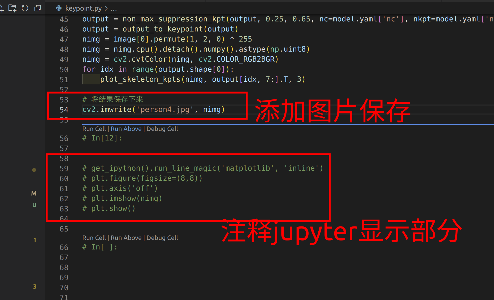
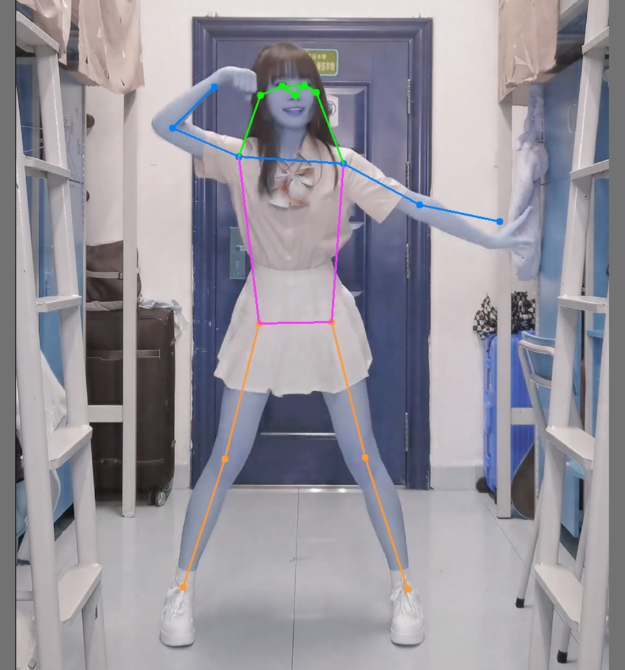
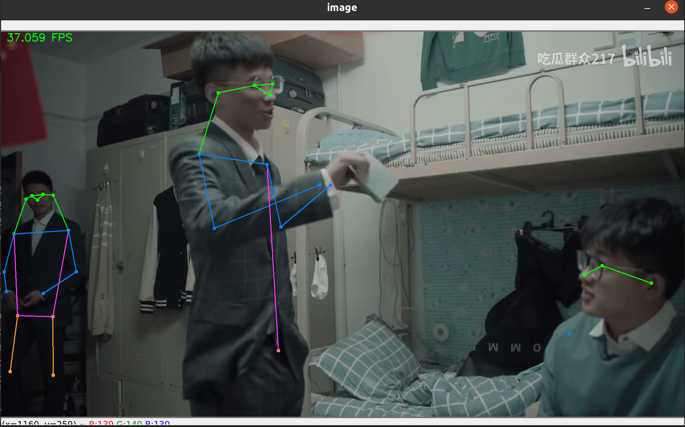

### 姿态模型

https://ghproxy.com/https://github.com/WongKinYiu/yolov7/releases/download/v0.1/yolov7-w6-pose.pt

### 代码

源码里是tools/keypoint.ipynb

转成py文件

```shell
jupyter nbconvert --to python tools/keypoint.ipynb
```

转移到源码根目录即可（已经转好了）。

`keypoint.py`



然后修改下相应的输入图片文件和保存的文件，直接运行即可。



# 视频

`video_pose.py`



> 参考： https://xugaoxiang.com/2022/07/21/yolov7/